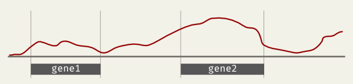

# covtools (archived)

The package is now maintained as **[bamtocov](https://github.com/telatin/bamtocov)**.

See [the documentation](https://telatin.github.io/bamtocov/).

## References
 * Brent Pedersen,  Aaron Quinlan, [hts-nim: scripting high-performance genomic analyses](https://academic.oup.com/bioinformatics/article/34/19/3387/4990493) (Bioinformatics)
 * Giovanni Birolo, Andrea Telatin, [covtobed: a simple and fast tool to extract coverage tracks from BAM files](https://joss.theoj.org/papers/10.21105/joss.02119) (JOSS)
